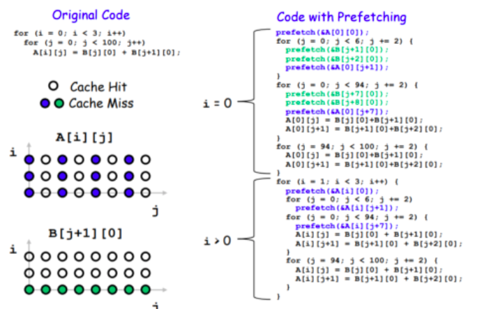

## Prefetching

José Luis Santillán

Pamela Mena 

Martin Navarro


### Tema: 
Hardware vs Software prefetching

### Objetivo General: 
Analizar técnicas de prefetching en hardware y software. 

### Objetivos específicos:  

-Describir ventajas y desventajas de hardware y software prefetching. 

-Implementar software prefetching en un programa de Python y Java en Windows y C++ en Linux. 

-Comparar el rendimiento y tiempos de ejecución de los programas cuando tienen técnicas de prefetching implementadas.

## ¿Qué es prefetching? 
El prefetching de datos es una técnica para ocultar los errores de cache a través de la obtención de información rápida, es decir, es una especulación sobre futuros accesos de datos y almacenarlos en memoria cache. La forma más común y eficiente que se conoce de prefetch es introducir una instrucción de prefetching en el programa. 

Adicionalmente, es importante mencionar que la técnica de prefetching utiliza recursos de ejecución del procesador. Por esta razón es importante verificar que las instrucciones que encargadas de prefetch, realicen prefetch de datos que no estén almacenados en el cache, caso contrario no trae beneficio alguno.  


### Efectividad del Prefetching 
3 aspectos: 

-Precisión: # prefetchs utiles/ # prefetchs 

-Cobertura: # prefetchs utiles/ # cache misses sin prefetching 

-Tiempo: tiempo que demora un prefetch en ejecutar

## Software Prefetching 
El software prefetching depende de que el programador o el compilador coloque explícitamente una instrucción de prefetching en la aplicación o programa para accesar a una referencia de memoria con tendencia a tener un cache miss (error de cache)

## Tipos 

-Array Prefetching: Las referencias de memoria emplean “subíndices de matriz afines”. Esto quiere decir que son combinaciones lineales de un bucle con variables constantes. Los programas que emplean array prefetching, presentan una ventaja, los patrones de acceso a la memoria caché se identifican de manera precisa cuando se compila el código. Siempre y cuando se conozca la dimensión del arreglo (matriz). Es por esto que se considera que los programas que usan referencias a arreglos afines son candidatos para realizar software prefetching cuando cumplen estas condiciones.



-Jump Pointer Prefetching (Queue Jumping): Los punteros de salto se utilizan para reducir la latencia de la memoria durante el proceso de prefetching. Queue Jumping se aplica a estructuras sencillas “backbone” que contiene un solo tipo de nodos que se conectan (como un árbol o una lista). En los saltos de cola cada puntero se añade a un nodo que son utilizados para obtener la estructura completa. 	


## Hardware  

El hardware prefetching usa mecanismos de hardware específicos para predecir datos que se necesitarán en un futuro próximo. Para estas técnicas, no es necesaria la intervención del compilador o del programador.  

### Tipos 
```markdown
-**Sequential prefetching:** Este método utiliza el principio de localidad espacial. 
Esto quiere decir que los datos que se acceden juntos son más probables que se almacenen juntos. 
El cache prefecthing se realiza normalmente en bloques para aprovechar esta técnica.  

Es decir, que se realizar un prefetch del bloque A+1, cuando el bloque A es accesado. 

-**Strided prefetching:** En este caso analiza y monitorea las diferencias entre las 
direcciones de los accesos a memoria y busca patrones. Ya sean patrones regulares o irregulares.  

  -**Regulares:** Para este caso, los accesos de memoria están 𝑠 direcciones aparte.
  Es decir que, el prefetcher calcula 𝑠, y usa para calcular la dirección de memoria para realizar el prefetching.  

  -**Irregulares:** Para este caso, el acceso es variable, pero de todas formas sigue un patrón. 
  Los prefetchers son más complejos, pero aprovechan esta propiedad para predecir accesos futuros 
 ```
# Ventajas y Desventajas
## Ventajas

### Hardware
En el hardware las ventajas que tiene el método de prefetching son: 

-Tiene información dinámica que permite reconocer errores que no son esperados en el cache y que son difíciles para el compilador de predecir 

-No se necesita instrucciones extra que utilicen recursos de ejecución 

### Software 

-Tiene mayor alcance  

-Se puede hacer prefecth a estructura de datos irregulares 

-Se puede entrenar al prefetch con muchos menos datos, mientras que en hardware esto no se puede 

## Desventajas

### Hardware
-Detectar los patrones de acceso de memoria 

-Se necesita un espacio en el cache para almacenar el prefeched data, si es que esa data por algún caso no es utilizada entonces el perfomance se reduce. 


-Cuando hay muchos datos o branches hay probabilidad de que los datos predicados no sean los deseados. 

 

### Software 

-En el caso del software el prefechting requiere y consumo muchos más recursos que si se lo haría en hardware. 

-El rango también es un problema, para ambos (hardware y software) ya que los parámetros que se les entrega son staticos y no se adaptan al tiempo de ejecucion 


# Implementacion Array prefetching

# Implementacion Hardware
# Conclusion
