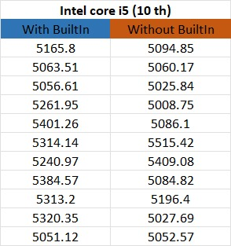

## Prefetching

José Luis Santillán

Pamela Mena 

Martin Navarro


### Tema: 
Hardware vs Software prefetching

### Objetivo General: 
Analizar técnicas de prefetching en hardware y software. 

### Objetivos específicos:  

-Describir ventajas y desventajas de hardware y software prefetching. 

-Implementar software prefetching en diferentes dispositivos. 

-Comparar el rendimiento y tiempos de ejecución de los programas cuando tienen técnicas de prefetching implementadas.

## ¿Qué es prefetching? 
Es una técnica -> mínimiza errores de cache -> obtención de información rápida

Es una especulación sobre futuros accesos de datos y almacenarlos en memoria cache. 

Utiliza recursos de ejecución del procesador.  


### Efectividad del Prefetching 
3 aspectos: 

-Precisión: # prefetchs utiles/ # prefetchs 

-Cobertura: # prefetchs utiles/ # cache misses sin prefetching 

-Tiempo: tiempo que demora un prefetch en ejecutar

## Software Prefetching 
El software prefetching depende de que el programador o el compilador coloque explícitamente una instrucción de prefetching en la aplicación o programa. 

## Tipos 

**-Array Prefetching:** Los programas que emplean array prefetching, presentan una ventaja, los patrones de acceso a la memoria caché se identifican de manera precisa cuando se compila el código. Siempre y cuando se conozca la dimensión del arreglo. 


**-Jump Pointer Prefetching (Queue Jumping):** Los punteros de salto se utilizan para reducir la latencia de la memoria durante el proceso de prefetching. Queue Jumping se aplica a estructuras sencillas “backbone” que contiene un solo tipo de nodos que se conectan (como un árbol o una lista). En los saltos de cola cada puntero se añade a un nodo que son utilizados para obtener la estructura completa. 	


# Implementacion Array prefetching
```markdown
#include <stdio.h>
#include <sys/time.h>
#include <stdlib.h>
#include <time.h>

void delay(int milliseconds)
{
    long pause;
    clock_t now,then;

    pause = milliseconds*(CLOCKS_PER_SEC/1000);
    now = then = clock();
    while( (now-then) < pause )
        now = clock();
}


int main(void) {
  srand(time(NULL));  
  struct timeval t1, t2;
  double elapsedTime;
  struct timeval t3, t4;
  double elapsedTime2;
  int number = 1000;
  int a[number];
  int b[number];

  for (int i = 0; i < number; i++){
    a[i] = rand(); 
    b[i] = rand();
  }
  gettimeofday(&t1, NULL);
  for (int i = 0; i < number; i++){
    a[i] = a[i] + b[i];
    delay(5);
    
  }
  gettimeofday(&t2, NULL);
  elapsedTime = (t2.tv_sec - t1.tv_sec) * 1000.0; 
  elapsedTime += (t2.tv_usec - t1.tv_usec) / 1000.0;
  printf("%f ms.\n", elapsedTime);
  
  
  gettimeofday(&t3, NULL);
  for (int i = 0; i < number; i++){
    __builtin_prefetch (&a[i+4],1,1);
    __builtin_prefetch (&b[i+4],0,1);
    a[i] = a[i] + b[i];
    delay(5);
    
  }
  gettimeofday(&t4, NULL);
  elapsedTime2 = (t4.tv_sec - t3.tv_sec) * 1000.0; 
  elapsedTime2 += (t4.tv_usec - t3.tv_usec) / 1000.0;
  printf("%f ms.\n", elapsedTime2);
}
```

## Gráficos
### Ryzen 7 series 4000


### Intel core i7(10th)


### Intel core i5(10th)




### Intel core i7(10th) Ubuntu


## Hardware  

El hardware prefetching usa mecanismos de hardware específicos para predecir datos que se necesitarán en un futuro próximo. Para estas técnicas, no es necesaria la intervención del compilador o del programador.  

### Tipos 
**-Sequential prefetching:** Este método utiliza el principio de localidad espacial. 
Esto quiere decir que los datos que se acceden juntos son más probables que se almacenen juntos. 

El cache prefecthing se realiza normalmente en bloques para aprovechar esta técnica.  
Es decir, que se realiza un prefetch del bloque A+1, cuando el bloque A es accesado. 


**-Strided prefetching:** En este caso analiza y monitorea las diferencias entre las 
direcciones de los accesos a memoria, buscando patrones (regulares o irregulares).  

  **- Regulares:** Los accesos de memoria están 𝑠 direcciones aparte.
  Es decir que, el prefetcher calcula 𝑠, y usa para calcular la dirección de 
  memoria para realizar el prefetching.  

  **- Irregulares:** Para este caso, el acceso es variable, pero de todas formas el prefetcher intenta buscar un patrón.
 
# Implementacion Hardware
### Software Strided Prefetching 
```markdown
#include <stdio.h>
#include <sys/time.h>
#include <stdlib.h>
#include <time.h>


int main(void){
    struct timeval t1, t2;
    double elapsedTime;
    gettimeofday(&t1, NULL);
    
    int N = 1000;
    int array[N*N];
    //Accesses an array sequentially in rowMajor 
    for (int i = 0; i < N; i++){
            for (int j = 0; j < N; j++){
                array[i*N+j]+=j;
            }
        }
        
    gettimeofday(&t2, NULL);
    elapsedTime = (t2.tv_sec - t1.tv_sec) * 1000.0; 
    elapsedTime += (t2.tv_usec - t1.tv_usec) / 1000.0;
    printf("%f ms.\n", elapsedTime);
    
    struct timeval t3, t4;
    double elapsedTime2;
    gettimeofday(&t3, NULL);
    
    //Accesses an array randomly (Strided) 
    for (int i = 0; i < N; i++){
            for (int j = 0; j < N; j++) {
                array[j * N + rand() % N]+=j;
            }
    }
    gettimeofday(&t4, NULL);
    elapsedTime2 = (t4.tv_sec - t3.tv_sec) * 1000.0; 
    elapsedTime2 += (t4.tv_usec - t3.tv_usec) / 1000.0;
    printf("%f ms.\n", elapsedTime2);
    
    
}
```
# Gráficos
### Strided Prefetching


### Hardware Prefetching


# Ventajas y Desventajas

## Hardware
### Ventajas

- Tiene información dinámica que permite reconocer errores que no son esperados en el cache y que son difíciles para que el compilador pueda predecir. 

- No se necesita instrucciones extra que utilicen recursos de ejecución. 

- Genera direcciones de prefetch automáticamente.

### Desventajas

- Detectar los patrones de acceso de memoria son complejos. 

- Se necesita un espacio en el cache para almacenar el prefeched data, si es que esa data por algún caso no es utilizada entonces el perfomance se reduce. 

- Cuando hay muchos datos o branches hay probabilidad de que los datos predicados no sean los deseados. 


## Software 
### Ventajas

- Tiene mayor alcance.  

- Se puede hacer prefecth a estructuras de datos irregulares. 

- Cuando se implementa software prefetching a programas necesita un soporte de hardware mínimo.

### Desventajas

- En el caso del software el prefechting requiere y consumo muchos más recursos que si se lo haría en hardware. 

- El rango también es un problema, para ambos (hardware y software) ya que los parámetros que se les entrega son staticos y no se adaptan al tiempo de ejecucion.

- Aumenta el tamaño de los programas, ya que explícitamente se debe escribir sentencias de 'prefetch'.


# Conclusiones

- El software prefetching es más eficaz y el programador tiene más control sobre esta ténica, debido a que en hardware prefetching no se tiene control sobre lo que ejecuta la máquina. 
- Se observo que en muchas de las ocasiones, las iteraciones secuenciales presentan mejor performance que realizandolo con prefetch. Ya que siempre realizar sumas uno a uno son más simples, más rápidas para compilar. 
- Es una técnica que se debe entender en un alto nivel para lograr aplicarla de la mejor manera posible.  

# Referencias

- CRC Press LLC. (2001). Data Cache Prefetching. Available at: https://ece.northeastern.edu/groups/nucar/CRCBook/Drafts/7.pdf 
- Mowry T. (2011). Compiler Algorithms for Prefetching Data. Available at: https://www.cs.cmu.edu/afs/cs/academic/class/15745-s13/public/lectures/L26-27-Data-Prefetching-1up.pdf
- Pourdowlat P et al. (2005). Hardware Prefetching Schemes. Available at: https://www.ee.ryerson.ca/~courses/ee8207/prefetchprj3.pdf
- Roth A. & Sohi G. (1999). Effective Jump Pointer Prefetching for Linked Data Structures. Available at: http://citeseerx.ist.psu.edu/viewdoc/download?doi=10.1.1.391.5339&rep=rep1&type=pdf
- Standford. (n.d). Hardware Prefetching .Available at: https://suif.stanford.edu/papers/mowry92/subsection3_5_2.html#:~:text=Hardware%2Dbased%20prefetching%20schemes%20have,instruction%20overhead%20to%20issue%20prefetches
- Technische Unversitat Berlin. [Prof. Dr. Ben H. Juurlink] (2019). Software Prefetching to Reduce Miss Rate or Miss Penalty [Video]. Youtube. https://www.youtube.com/watch?v=EahLWVG2cNU 
- Veidenbaum A. (1997).  Stride-directed Prefetching for Secondary Caches. Available at: https://www.ics.uci.edu/~alexv/Papers/icpp97.pdf


    
